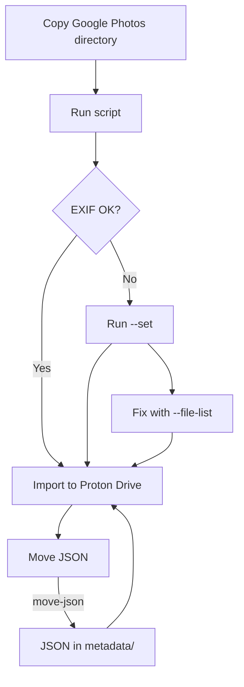

# Proton Drive - Google Takeout Setup

Normalize and fix creation dates for media files exported from Google Photos.

## Install

```bash
pip install -r requirements.txt
```

## Contribute

Tests and linting:

```bash
./dev all
```

## Date resolution logic

The script determines creation dates using this priority order:

1. **EXIF primary tags**: `CreationDate`, `DateTimeOriginal`, `MediaCreateDate`
2. **Google Takeout JSON**: from `.supplemental-metadata.json` files
3. **Filename**: patterns like `IMG_2024-01-15_at_14.30.00.jpg`
4. **Folder name**: from folders like `Foto da 2024` or `Photos from 2024`

If no date is found, the file is reported in the output.

All operations are logged to `creation_date.log` in CSV format.

## Usage



### 1. Copy Google Photos directory

Copy your `Google Photo`, `Google Foto`, `GooglePhotos`, or `Google Photos` directory
to the same folder as this script.

### 2. Check current status

Run without parameters to see a report of files with missing EXIF data:

```bash
python proton_drive_gts.py
```

This shows which files are missing primary EXIF dates and need fixing.

### 3. Set creation dates

Fix creation dates in both filesystem and EXIF metadata:

```bash
python proton_drive_gts.py --set
```

Use `--dry-run` first to preview changes:

```bash
python proton_drive_gts.py --set --dry-run
```

### 4. Move JSON metadata (optional)

Move Google Takeout metadata files to a dedicated folder:

```bash
python proton_drive_gts.py --move-json
```

To restore them:

```bash
python proton_drive_gts.py --rollback-json
```

### 5. Import to Proton Drive

After fixing dates, import your files to Proton Drive following
[Proton Drive import instructions](https://proton.me/drive/import).

### Fix remaining issues

If some files still have wrong dates after import:

1. Use Proton Drive SDK to export the list of files with wrong dates
2. Save the list to a text file (one filename per line)
3. Run with `--file-list` to fix only those files:

```bash
python proton_drive_gts.py --set --file-list wrong_dates.txt
```
